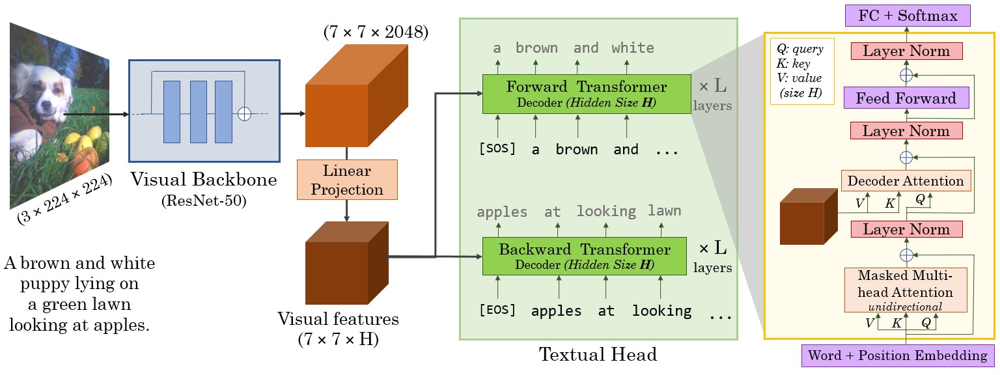

VirTex: Learning Visual Representations from Textual Annotations
================================================================

<h4>
Karan Desai and Justin Johnson
</br>
<span style="font-size: 14pt; color: #555555">
University of Michigan
</span>
</h4>
<hr>

**CVPR 2021** [arxiv.org/abs/2006.06666][1]

**Model Zoo, Usage Instructions and API docs:** [kdexd.github.io/virtex](https://kdexd.github.io/virtex)

VirTex is a pretraining approach which uses semantically dense captions to
learn visual representations. We train CNN + Transformers from scratch on
COCO Captions, and transfer the CNN to downstream vision tasks including
image classification, object detection, and instance segmentation.
VirTex matches or outperforms models which use ImageNet for pretraining -- 
both supervised or unsupervised -- despite using up to 10x fewer images.




Get the pretrained ResNet-50 visual backbone from our best performing VirTex
model in one line *without any installation*!

```python
import torch

# That's it, this one line only requires PyTorch.
model = torch.hub.load("kdexd/virtex", "resnet50", pretrained=True)
```

### Note (For returning users before January 2021):

The pretrained models in our model zoo have changed from [`v1.0`](https://github.com/kdexd/virtex/releases/tag/v1.0) onwards.
They are slightly better tuned than older models, and reproduce the results in our
CVPR 2021 accepted paper ([arXiv v2](https://arxiv.org/abs/2006.06666v2)). 
Some training and evaluation hyperparams are changed since [`v0.9`](https://github.com/kdexd/virtex/releases/tag/v0.9).
Please refer [`CHANGELOG.md`](https://github.com/kdexd/virtex/blob/master/CHANGELOG.md)


Usage Instructions
------------------

1. [How to setup this codebase?][2]  
2. [VirTex Model Zoo][3]  
3. [How to train your VirTex model?][4]  
4. [How to evaluate on downstream tasks?][5]  

Full documentation is available at [kdexd.github.io/virtex](https://kdexd.github.io/virtex).


Citation
--------

If you find this code useful, please consider citing:

```text
@inproceedings{desai2021virtex,
    title={{VirTex: Learning Visual Representations from Textual Annotations}},
    author={Karan Desai and Justin Johnson},
    booktitle={CVPR},
    year={2021}
}
```

Acknowledgments
---------------

We thank Harsh Agrawal, Mohamed El Banani, Richard  Higgins, Nilesh Kulkarni
and Chris Rockwell for helpful discussions and feedback on the paper. We thank
Ishan Misra for discussions regarding PIRL evaluation protocol; Saining Xie for
discussions about replicating iNaturalist evaluation as MoCo; Ross Girshick and
Yuxin Wu for help with Detectron2 model zoo; Georgia Gkioxari for suggesting
the Instance Segmentation pretraining task ablation; and Stefan Lee for
suggestions on figure aesthetics. We thank Jia Deng for access to extra GPUs
during project development; and UMich ARC-TS team for support with GPU cluster
management. Finally, we thank all the Starbucks outlets in Ann Arbor for many
hours of free WiFi. This work was partially supported by the Toyota Research
Institute (TRI). However, note that this article solely reflects the opinions
and conclusions of its authors and not TRI or any other Toyota entity.


[1]: https://arxiv.org/abs/2006.06666
[2]: https://kdexd.github.io/virtex/virtex/usage/setup_dependencies.html
[3]: https://kdexd.github.io/virtex/virtex/usage/model_zoo.html
[4]: https://kdexd.github.io/virtex/virtex/usage/pretrain.html
[5]: https://kdexd.github.io/virtex/virtex/usage/downstream.html
